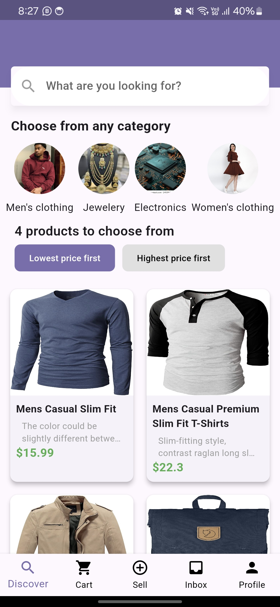

# Patch Marketplace App

A simple Flutter-based mobile app for browsing products, filtering them by categories, and sorting them by price. The app fetches product data from a mock API and displays it in an easy-to-use grid layout with dynamic interaction.

---

## Features

- **Product Feed**: Dynamically fetched products from an API.
- **Category Filter**: Allows filtering products based on categories.
- **Price Sorting**: Sort products by price (lowest to highest or highest to lowest).
- **Search Functionality**: Built-in search bar to find products easily.
- **Bottom Navigation Bar**: Easy access to key app sections.
- **Clean UI**: Simple, modern UI with smooth navigation and sorting features.

---

## Screenshots



---

## Prerequisites

Before you begin, ensure you have the following installed:

- **[Flutter](https://flutter.dev/docs/get-started/install)**: Framework for building cross-platform apps.
- **[Dart](https://dart.dev/get-dart)**: Programming language used by Flutter.
- **A Mobile Device/Emulator**: To run the app.
- **recommended - Android Studio**: To run the app.

---

## Setup Instructions

Follow these steps to get the app up and running:

### 1. Clone the Repository

Clone the repository to your local machine:

```bash
git clone https://github.com/challenger456/patch_marketplace


Navigate to the project directory and install dependencies:

cd patch_marketplace`
``flutter pub get``

3. Run the App

To run the app on your connected device or emulator, use the following command

``flutter run``

App Details

Home Screen

Search Bar: To quickly search for products.
Category Filter: Select from available categories to filter products.
Sort Buttons: Options to sort products by price in ascending or descending order.
Product Count: Displays the total number of products currently on screen.
Product Grid: Displays products in a grid layout.

Libraries and Packages

get: State management for reactive updates.
flutter: Core framework for building the app.

License
This project is licensed under the MIT License.
